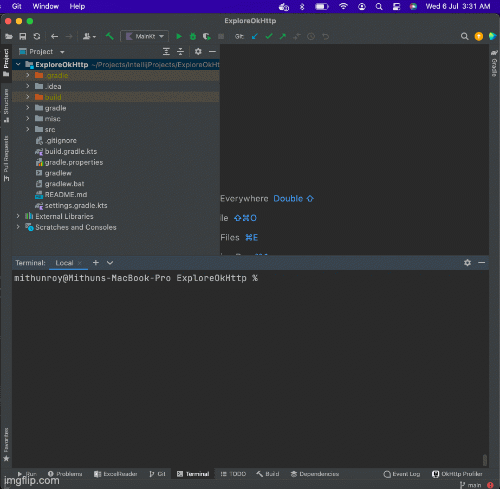

# ExploreOkHttp

An exploratory console application written in [kotlin](https://kotlinlang.org/) to showcase how to
use [OkHttp](https://square.github.io/okhttp/) a modern applications HTTP client.

## What can you find?
- Use and configure OkHttpClient.Builder to get OkHttpClient. 
- Add interceptors, such as 
  - HttpLoggingInterceptor 
  - custom interceptors, serving different purposes, such as authentication, or add custom headers
  - Network layer interceptor ***(such as to enable caching)***
  - Application layer network interceptor ***(enforce cache to be used)***

### OkHttp Interceptor design

### Demo for network caching using interceptors

### Dependencies
- com.squareup.okhttp3:okhttp:4.10.0
- com.squareup.okhttp3:logging-interceptor:4.10.0
- com.google.code.gson:gson:2.9.0

**[TODO]** Explore authenticator use cases.

## References
- [OkHttp](https://square.github.io/okhttp/) - official site
- [mindorks-okhttp-interceptors](https://blog.mindorks.com/okhttp-interceptor-making-the-most-of-it) - nice use cases of interceptors
- [objectpartners-authenticator](https://objectpartners.com/2018/06/08/okhttp-authenticator-selectively-reauthorizing-requests/) - explain in detail usage of authenticator
- [baeldung-okhttp-interceptors](https://www.baeldung.com/java-okhttp-interceptors)